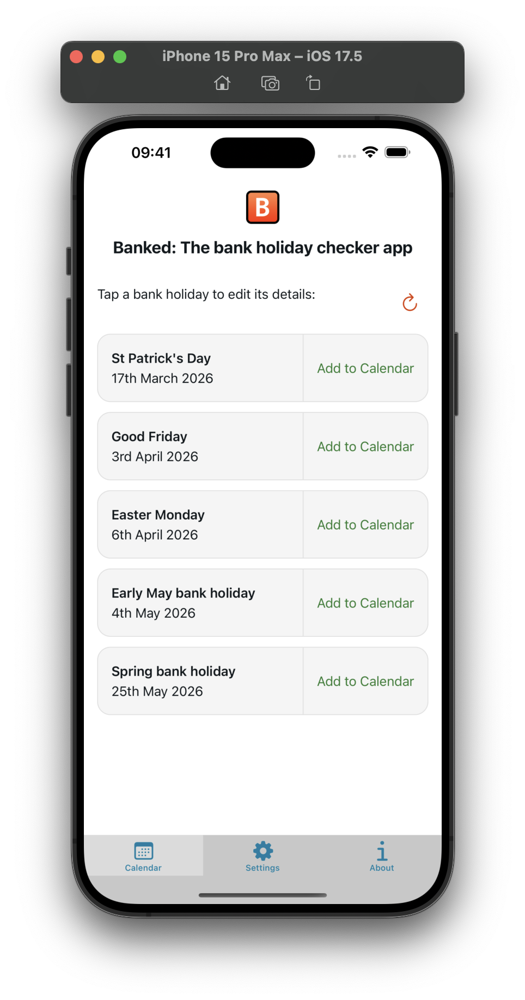
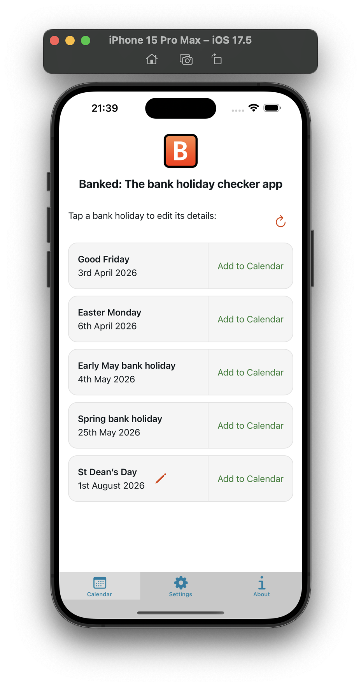
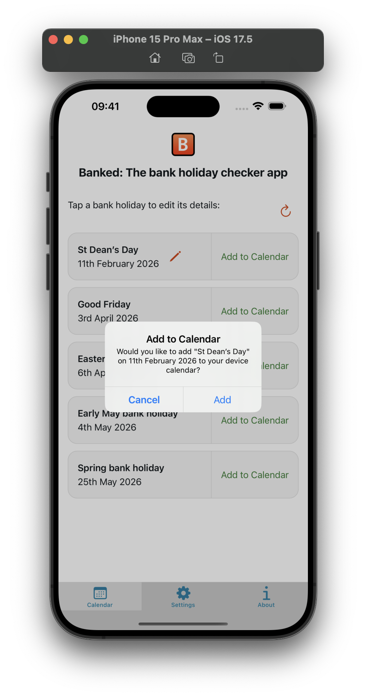
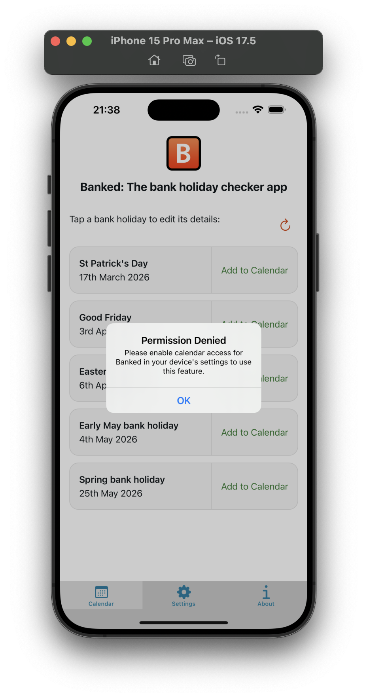
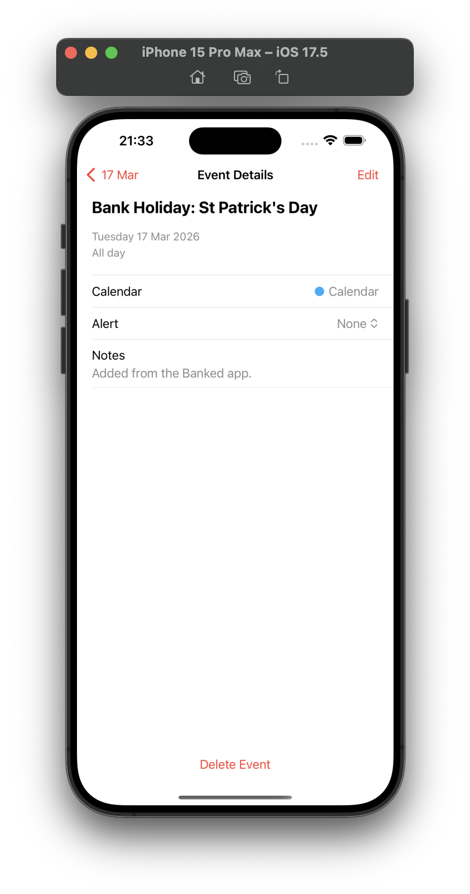
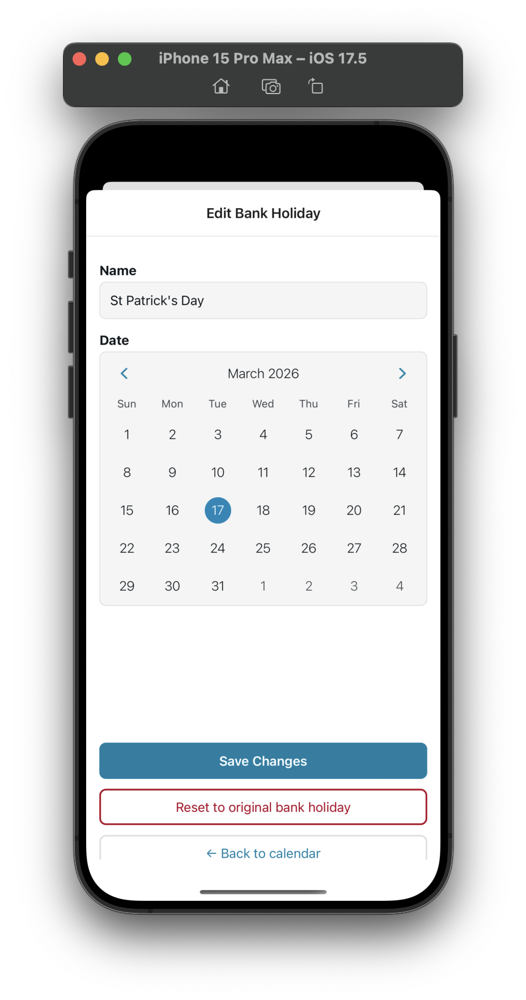
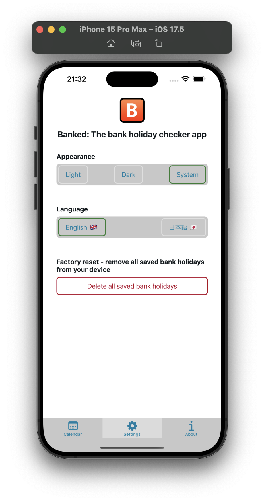
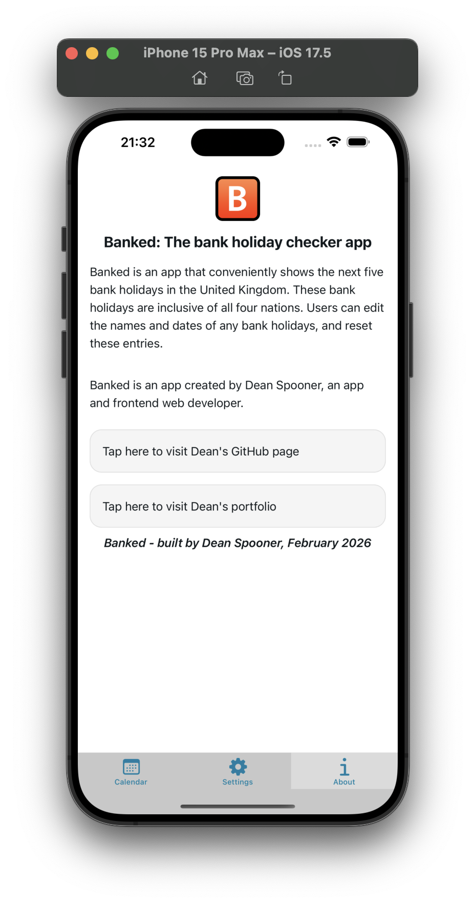

# Banked by [Dean Spooner](https://github.com/DeanSpooner) - v1.0.0 now available to install on Android [here](https://github.com/DeanSpooner/banked/releases/tag/1.0.0)! 📆


Your bank holiday checker app!

## Description

Banked is a iOS and Android app where users can see upcoming bank holidays in the United Kingdom. In Banked, you will be able to:

- see the five next bank holidays across the United Kingdom;
- edit the name and date of bank holidays;
- save bank holidays to your device's calendar;
- refresh the data on swipe or by pressing the refresh button;
- customise the theme of the app.

## Development Progress

- [x] Data fetching and processing from the GOV.uk website;
- [x] Display of data;
- [x] Edit functionality;
- [x] Calendar integration;
- [x] Styling;
- [x] Testing (Jest unit tests).

## Stack

This project uses the following tech stack:

- Expo;
- React Native;
- Jest;
- TypeScript;
- Husky;
- date-fns;
- Xcode/iOS Simulator;
- Android Studio/Android Emulator;
- Expo Go;
- MaterialUI.

## Future aims

As well as the above, Banked intends to also add the following features in the future:

- [x] Reset edit bank holidays back to their original entry;
- [x] Confirmation modals for editing and reset bank holiday data, and for adding to calendar;
- [x] Offline support with cached data;
- [x] User settings (cached data deletion);
- [x] Pull-to-refresh re-fetching of bank holiday data;
- [x] Toggle between light mode, dark mode and system default;
- [x] i18n - English and Japanese integrated;
- [] Swipe gestures;
- [] Animations;
- [] Deeper end-to-end testing with Detox.

## Screenshots

### Calendar/Home Screen



### Calendar/Home Screen with Edited Bank Holiday



### Add to Calendar Confirmation



### Calendar Permission Denied Handling



### Bank Holiday in Device Calendar



### Edit Screen



### Settings Screen



### About Screen



## Running this repo locally:

1. Install dependencies

   ```bash
   npm install
   ```

2. Start the app

   ```bash
   npx expo start
   ```

In the output, you'll find options to open the app in a:

- [development build](https://docs.expo.dev/develop/development-builds/introduction/);
- [Android Emulator](https://docs.expo.dev/workflow/android-studio-emulator/);
- [iOS Simulator](https://docs.expo.dev/workflow/ios-simulator/);
- [Expo Go](https://expo.dev/go), a limited sandbox for trying out app development with Expo.

## By [Dean Spooner](https://github.com/DeanSpooner) 📆


